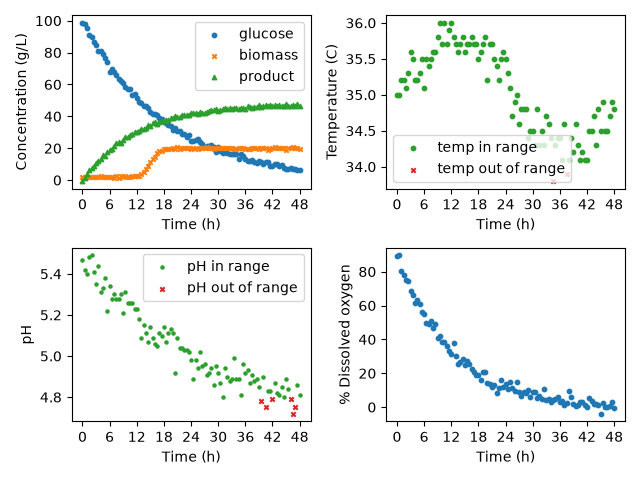

# Bioprocess Effectiveness Analyzer

### Overview:
    The objective of this project was to create a python class that allows for the generation of 
    figures and tables relating to the effectiveness of different bioprocessors given a csv file
    containing the necessary data points.
### Features:
    This python class creates an object with the given inputs of a csv filepath and arrays of both
    temperature and pH limits. The class contains functions that allow for the generation of 4 scatter
    plot graphs with the following plots: concentration vs time, temperature vs time, pH vs time and
    dissolved oxygen % vs time. Additionally it creates a summary table, showing the percentage of
    data outside of the temperature and pH limits in each batch and the final product concentration.
    It does this using helper functions that do the following: extract all information pertaining to
    a particular batch, create a temperature mask, create a pH max and find the total number of batches
    in the dataset.
### Technologies Used:
    -python 3.14.7
    -matplotlib.pyplot 3.11.0
    -matplotlib.ticker 3.11.0
    -numpy 2.5.2
    -pandas 3.0.5
### Code Design:
    Upon running main.py the program uses a dictionary of  two preset modes to iterate in a for loop to create 
    corresponding to the different modes and the fermentation dataset. Using the get_n_batches function to define
    an upper limit, a nested for loop is used to create a dashboard and summary table. The dashboard function uses
    the mask helper functions and data extraction method to pull all information related to the batch and determine
    where said values should lie. It then uses matplotlib to create scatter plots for each desired graph. The 
    summary table function then uses the uses the get_n_batches, nested for loops, and mask helper functions to 
    determine the percentage of data points outside the masks and takes the final value for a given batch in the 
    product concentration column and adds it to the table. 
### Dashboard:
Dashboard for batch 1 of the bioprocessor in mode A.

### Summary Table:

Table summarizing batch data in mode A.

|Batch ID|pH optimal percentage|temperature optimal percentage|final product concentration g/L|
|--------|---------------------|------------------------------|-------------------------------|
|1       |93.81                |97.94                         |46.5                           |
|2       |96.69                |97.52                         |50.8                           |
|3       |95.89                |93.15                         |44.6                           |
|4       |100.0                |96.47                         |48.6                           |
|5       |48.62                |99.08                         |24.7                           |

